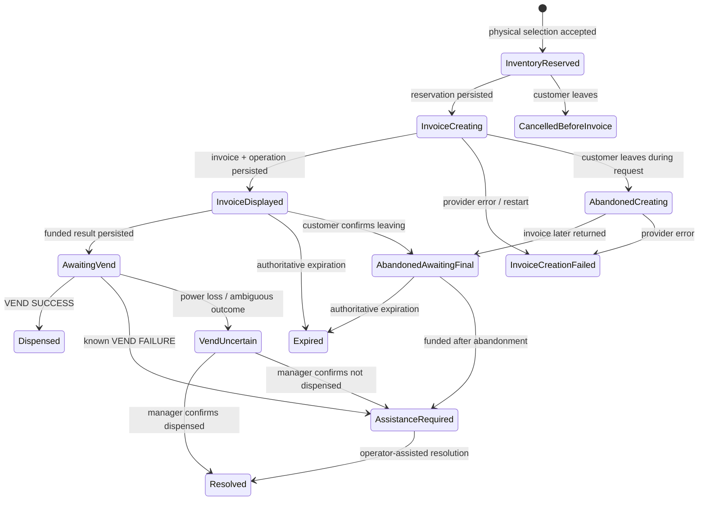

# LightningVEND architecture

LightningVEND is a Cargo workspace so protocol, durable domain logic, payment
integration, and the two Iced applications can evolve independently.

| Package | Responsibility |
|---|---|
| `lv-core` | Catalog, exact `Msats`, inventory/entitlements, durable purchases, and manager command/event wire types |
| `lv-mdb` | MDB Level 1 protocol, serial transport, typed session ownership, and the test harness |
| `lv-vendimint` | Vendimint identity/payment facade and authenticated Iroh manager RPC framing |
| `lv-kiosk` | Portrait customer/admin Iced UI, redb persistence, and orchestration of the state-owning actors |
| `lv-manager` | Landscape manager Iced application (initial shell) |
| `mdb-flow-test` | Hardware qualification utility |
| `lv-e2e-tests` | Opt-in regtest system tests for Fedimint, Vendimint pairing, and the manager ALPN |

The kiosk process keeps mutable domain state on the Iced thread and gives each
exclusive I/O resource a dedicated Tokio actor. UI messages, MDB events,
Vendimint payment results, and remote manager requests are serialized back
through the kiosk update loop. A state transition is persisted before any
externally irreversible follow-up such as displaying an invoice or approving
an MDB vend.

## Durable Lightning purchase

Solid-state boxes below hold an inventory reservation. Abandoning an invoice
releases that reservation immediately but permanently removes vend authority
from the invoice.

On restart, a displayed unpaid invoice becomes abandoned and non-vendable. A
purchase which had already reached `AwaitingVend` becomes `VendUncertain`, and
its slot is blocked pending manager review. LightningVEND never automatically
repeats an uncertain vend.

## Manager relationship

Vendimint owns the persistent Iroh identities and machine-claim relationship.
The kiosk registers `lightningvend/manager/1` as an additional protocol that
Vendimint exposes only to the manager which claimed that machine. The manager
connects with that same authenticated identity.

LightningVEND frames versioned JSON requests and responses with a four-byte
length prefix and a 1 MiB limit. The network handler does not mutate state; it
forwards an authenticated request to the kiosk actor and waits for the actor's
durable response. Command IDs support idempotency, state revisions protect
read-modify-write inventory commands, and event sequence numbers support
catch-up from an append-only event log.

Initial pairing displays a kiosk claim QR without requiring an admin PIN. The
manager and physically present kiosk operator compare/confirm Vendimint's claim
PIN. After the claim, the manager sets the kiosk name and initial admin PIN.
Only the same claimed manager may change that PIN remotely.
